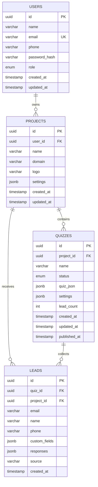
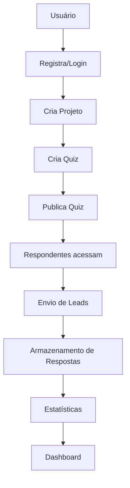

# Diagrama de Dados - Quiz Builder

## 📊 Entity Relationship Diagram (ERD)



## 📋 Detalhamento das Entidades

### 👤 **USERS** (Usuários)
| Campo | Tipo | Descrição | Restrições |
|-------|------|-----------|------------|
| `id` | UUID | Identificador único | PK, Auto-generated |
| `name` | VARCHAR(255) | Nome completo do usuário | NOT NULL |
| `email` | VARCHAR(255) | Email do usuário | NOT NULL, UNIQUE |
| `phone` | VARCHAR(20) | Telefone do usuário | NULLABLE |
| `password_hash` | VARCHAR(255) | Hash da senha | NOT NULL |
| `role` | ENUM | Papel do usuário | 'owner', 'admin', 'editor', 'viewer' |
| `created_at` | TIMESTAMP | Data de criação | Auto-generated |
| `updated_at` | TIMESTAMP | Data de atualização | Auto-updated |

### 📁 **PROJECTS** (Projetos)
| Campo | Tipo | Descrição | Restrições |
|-------|------|-----------|------------|
| `id` | UUID | Identificador único | PK, Auto-generated |
| `user_id` | UUID | ID do usuário proprietário | FK → USERS.id |
| `name` | VARCHAR(255) | Nome do projeto | NOT NULL |
| `domain` | VARCHAR(255) | Domínio do projeto | NULLABLE |
| `logo` | VARCHAR(500) | URL do logo | NULLABLE |
| `settings` | JSONB | Configurações do projeto | NULLABLE |
| `created_at` | TIMESTAMP | Data de criação | Auto-generated |
| `updated_at` | TIMESTAMP | Data de atualização | Auto-updated |

### 🎯 **QUIZZES** (Quizzes)
| Campo | Tipo | Descrição | Restrições |
|-------|------|-----------|------------|
| `id` | UUID | Identificador único | PK, Auto-generated |
| `project_id` | UUID | ID do projeto | FK → PROJECTS.id |
| `name` | VARCHAR(255) | Nome do quiz | NOT NULL |
| `status` | ENUM | Status do quiz | 'draft', 'published', 'archived' |
| `quiz_json` | JSONB | Estrutura do quiz | NOT NULL |
| `settings` | JSONB | Configurações do quiz | NULLABLE |
| `lead_count` | INTEGER | Contador de leads | DEFAULT 0 |
| `created_at` | TIMESTAMP | Data de criação | Auto-generated |
| `updated_at` | TIMESTAMP | Data de atualização | Auto-updated |
| `published_at` | TIMESTAMP | Data de publicação | NULLABLE |

### 📝 **LEADS** (Leads/Respostas)
| Campo | Tipo | Descrição | Restrições |
|-------|------|-----------|------------|
| `id` | UUID | Identificador único | PK, Auto-generated |
| `quiz_id` | UUID | ID do quiz | FK → QUIZZES.id |
| `project_id` | UUID | ID do projeto | FK → PROJECTS.id |
| `email` | VARCHAR(255) | Email do respondente | NULLABLE |
| `name` | VARCHAR(255) | Nome do respondente | NULLABLE |
| `phone` | VARCHAR(20) | Telefone do respondente | NULLABLE |
| `custom_fields` | JSONB | Campos customizados | NULLABLE |
| `responses` | JSONB | Respostas do quiz | NOT NULL |
| `source` | VARCHAR(100) | Fonte do lead | NULLABLE |
| `created_at` | TIMESTAMP | Data de criação | Auto-generated |

## 🔗 Relacionamentos

### 1. **USERS → PROJECTS** (1:N)
- Um usuário pode ter múltiplos projetos
- Cada projeto pertence a um único usuário
- Relacionamento obrigatório (cascade delete)

### 2. **PROJECTS → QUIZZES** (1:N)
- Um projeto pode ter múltiplos quizzes
- Cada quiz pertence a um único projeto
- Relacionamento obrigatório (cascade delete)

### 3. **PROJECTS → LEADS** (1:N)
- Um projeto pode receber múltiplos leads
- Cada lead está associado a um projeto
- Relacionamento obrigatório (cascade delete)

### 4. **QUIZZES → LEADS** (1:N)
- Um quiz pode coletar múltiplos leads
- Cada lead está associado a um quiz
- Relacionamento obrigatório (cascade delete)

## 📊 Índices Recomendados

```sql
-- Índices para performance
CREATE INDEX idx_users_email ON users(email);
CREATE INDEX idx_projects_user_id ON projects(user_id);
CREATE INDEX idx_quizzes_project_id ON quizzes(project_id);
CREATE INDEX idx_quizzes_status ON quizzes(status);
CREATE INDEX idx_leads_quiz_id ON leads(quiz_id);
CREATE INDEX idx_leads_project_id ON leads(project_id);
CREATE INDEX idx_leads_created_at ON leads(created_at);
```

## 🔄 Fluxo de Dados



## 📈 Exemplo de Dados

### Estrutura do `quiz_json`
```json
{
  "questions": [
    {
      "id": "q1",
      "type": "multiple_choice",
      "question": "Qual é sua linguagem favorita?",
      "options": ["JavaScript", "Python", "Java", "C++"],
      "correct_answer": 0,
      "required": true
    },
    {
      "id": "q2",
      "type": "text",
      "question": "Descreva sua experiência:",
      "required": false
    }
  ],
  "settings": {
    "time_limit": 300,
    "show_results": true,
    "allow_anonymous": false
  }
}
```

### Estrutura do `responses`
```json
{
  "q1": 2,
  "q2": "Tenho 3 anos de experiência com JavaScript",
  "submitted_at": "2024-01-15T10:30:00Z"
}
```

### Estrutura do `custom_fields`
```json
{
  "idade": "25",
  "cidade": "São Paulo",
  "empresa": "Tech Corp",
  "cargo": "Desenvolvedor"
}
```

## 🛡️ Considerações de Segurança

1. **Senhas**: Hash com bcryptjs (salt rounds: 10)
2. **JWT**: Tokens com expiração configurável
3. **Validação**: Todos os inputs validados com class-validator
4. **Autorização**: Verificação de propriedade em todos os recursos
5. **CORS**: Configurado para origens específicas
6. **SQL Injection**: Prevenido pelo TypeORM
7. **XSS**: Sanitização automática de dados

## 📊 Métricas e Estatísticas

### Contadores Automáticos
- `lead_count` em QUIZZES é incrementado automaticamente
- Estatísticas calculadas em tempo real via queries agregadas
- Histórico de atividades mantido via timestamps

### Queries de Estatísticas
```sql
-- Total de leads por quiz
SELECT quiz_id, COUNT(*) as total_leads 
FROM leads 
GROUP BY quiz_id;

-- Leads por projeto
SELECT project_id, COUNT(*) as total_leads 
FROM leads 
GROUP BY project_id;

-- Quizzes publicados por projeto
SELECT project_id, COUNT(*) as published_quizzes 
FROM quizzes 
WHERE status = 'published' 
GROUP BY project_id;
``` 